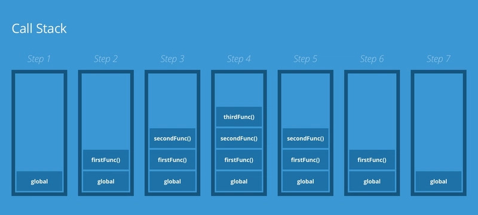

# 01 - Execution Context & Call Stack

Execution context defines **where and how JavaScript code is executed**.  
The **call stack** manages the order of execution for these contexts.  

Understanding these concepts helps debug scope issues, closures, and function behavior.

---

## ⚡ Quick Summary (TL;DR)

- **Execution Context (EC):** Environment where JS code runs  
- **Global EC (GEC):** Created when JS starts; contains global variables and functions  
- **Function EC (FEC):** Created whenever a function is called; has its own scope  
- **Call Stack:** Tracks active execution contexts in **LIFO** order  
- Helps understand **synchronous execution flow**, **variable scope**, and **closures**

---

📂 **Code Reference:**

_View complete examples in the context._

- [execution-context.js](execution-context.js)

---

## 1. What Is Execution Context?

An **execution context** is like a container that stores:

- Variable environment (`var`, `let`, `const`)  
- Function declarations  
- Reference to the outer environment  
- `this` value  

---

## 2. Types of Execution Context

JavaScript creates a new **execution context** whenever **global code runs or a function is invoked**.  
There are three main types:

### 2.1 Global Execution Context (GEC)

- Created **once** when the program starts  
- Only **one GEC** exists at a time  
- Responsible for:  
  - Global variables & functions  
  - Setting up the **global object** (`window` in browsers, `global` in Node.js)  
  - Defining `this` (points to global object in non-strict mode; `undefined` in strict mode)  

```js
console.log(this); // In browsers → Window object
```

---

### 2.2 Function Execution Context (FEC)

- Created **every time a function is invoked**  
- Each function call gets its own context  
- Responsible for:  
  - Local variables, arguments, inner functions  
  - Creating a new **scope chain**  
  - Setting the value of `this` (depends on how function is called)  

```js
function greet(name) {
  console.log("Hello " + name);
}

greet("Sumaya"); // Creates a new FEC
```

---

### 2.3 Eval Execution Context

- Created when `eval()` runs code inside the current scope  
- Rarely used in modern JS (bad for performance & security)  
- Shares scope with surrounding code  

```js
eval("console.log('Eval context created!')");
```

---

## 3. Visual Representation



---

## 4. Call Stack

The **call stack** is a **stack data structure** that keeps track of active execution contexts.

- **Push:** Add context when a function is called  
- **Pop:** Remove context when function finishes  

**Example:**

```js
function first() {
  console.log("Inside first");
  second();
}

function second() {
  console.log("Inside second");
  third();
}

function third() {
  console.log("Inside third");
}

first();
```

**Call Stack Flow:**

| Step | Call Stack State       |
|------|----------------------|
| 1    | Global EC → pushes `first()` |
| 2    | `first()` → pushes `second()` |
| 3    | `second()` → pushes `third()` |
| 4    | `third()` finishes → popped |
| 5    | `second()` finishes → popped |
| 6    | `first()` finishes → popped |

---

## 💡 Best Practices

- ✅ Keep functions small and focused to reduce stack depth  
- ✅ Avoid deep recursion unless necessary  
- ✅ Understand how the call stack interacts with closures and `this`  
- ✅ Debug using console logs to visualize stack flow  

---

## 🔗 Navigation

### 🔜 Next Topic

- [→ Memory Management & Garbage Collection](../02-memory-management/README.md)  
_Learn how JavaScript allocates, uses, and frees memory during execution._

### 🔙 Previous Topic

- [← JavaScript Fundamentals Overview](../../01-fundamentals/README.md)  
_Review the foundational concepts of JavaScript._

---

### 📂 Explore More

- [← Back to Core JavaScript Mechanics Overview](../README.md)  
_Browse all Part 1 mechanics topics._

- [🏠 Main JavaScript Guide](../../README.md)  
_Return to the full roadmap and module list._
