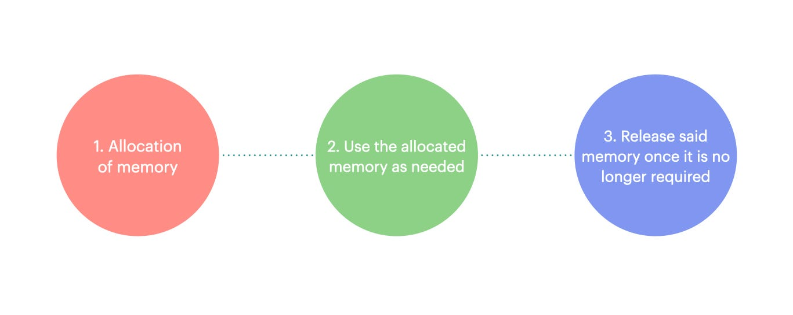
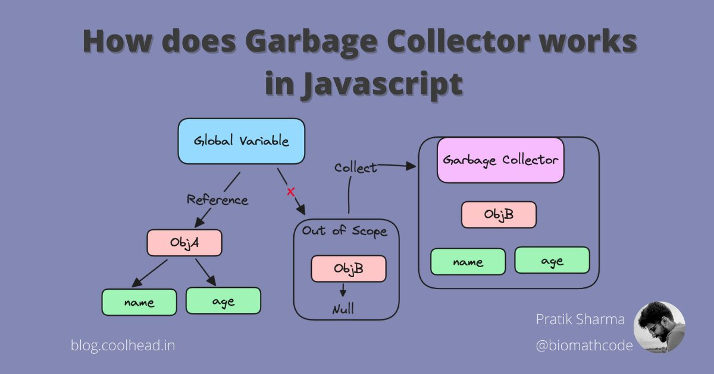

# 02 - Memory Management & Garbage Collection

Memory management in JavaScript defines **how memory is allocated, used, and freed** during program execution.  
**Garbage collection (GC)** automatically cleans up memory that is no longer needed, helping prevent memory leaks.

Understanding these concepts ensures more efficient code and avoids performance issues in long-running applications.

---

## ⚡ Quick Summary (TL;DR)

- **Memory Allocation:** JS reserves memory for variables, objects, and functions  
- **Memory Usage:** Variables and objects occupy memory during execution  
- **Garbage Collection (GC):** Automatically frees memory that is no longer referenced  
- **Common GC Strategies:** Reference counting, Mark-and-Sweep  
- **Why It Matters:** Poor memory management can cause slowdowns and even crashes  
- Helps write **efficient, memory-safe** JavaScript code  

---

📂 **Code Reference:**

_See full examples in the reference file._  

- [memory-management.js](memory-management.js)

---

## 1. What Is Memory Management?

JavaScript handles memory in three main stages:

1. **Allocation:** Reserve memory for variables, objects, and functions  
2. **Usage:** Program executes and updates data stored in memory  
3. **Garbage Collection:** Unused memory is automatically reclaimed

```js
// Example of memory allocation and usage
let name = "Sumaya"; // Allocated memory for string
let user = { name: "Sumaya", age: 21 }; // Allocated memory for object

// After removing references, memory can be garbage collected
user = null; // No references → eligible for GC in next cycle
```

---

## 2. Garbage Collection Mechanisms

### 2.1 Reference Counting

- Keeps track of the number of references to a value  
- When count reaches zero, memory can be freed  
- **Limitation:** Cannot detect circular references  

```js
let a = {};
let b = a; // Reference count = 2

b = null; // Reference count decreases, object still referenced by 'a'
a = null; // Reference count = 0 → eligible for GC
```

⚠️ Example of a **circular reference** problem:

```js
let a = {};
let b = {};
a.ref = b;
b.ref = a; // Circular reference

a = b = null; 
// Reference counting fails here, 
// but Mark-and-Sweep can reclaim this memory
```

---

### 2.2 Mark-and-Sweep

- JS engine periodically scans memory to mark reachable values  
- Unmarked (unreachable) values are removed  
- Solves circular reference issues that reference counting cannot handle  

```js
function createUser() {
    let user = { name: "Sumaya" };
    return user;
}

let newUser = createUser(); // 'user' is referenced by newUser
newUser = null; // Object becomes unreachable → eligible for GC
```

---

## 3. Visual Representation

  
  
_(Custom diagram showing allocation → usage → garbage collection lifecycle)_

---

## 4. Memory Management Best Practices

- ✅ Avoid unnecessary global variables  
- ✅ Be cautious with closures holding large objects  
- ✅ Nullify references when no longer needed (`object = null`)  
- ✅ Monitor memory usage for long-running apps (e.g., using browser dev tools)  
- ✅ Avoid creating circular references if possible  

---

## 🔗 Navigation

### 🔜 Next Topic

- [→ Scope & Lexical Environment](../03-scope-lexical-environment/README.md)  
_Learn how JavaScript determines variable accessibility and manages lexical environments._

### 🔙 Previous Topic

- [← Execution Context & Call Stack](../01-execution-context-call-stack/README.md)  
_Review how JS executes code and manages the call stack._

---

### 📂 Explore More

- [← Back to Core JavaScript Mechanics Overview](../README.md)  
_Browse all Part 1 mechanics topics._

- [🏠 Main JavaScript Guide](../../README.md)  
_Return to the full roadmap and module list._
